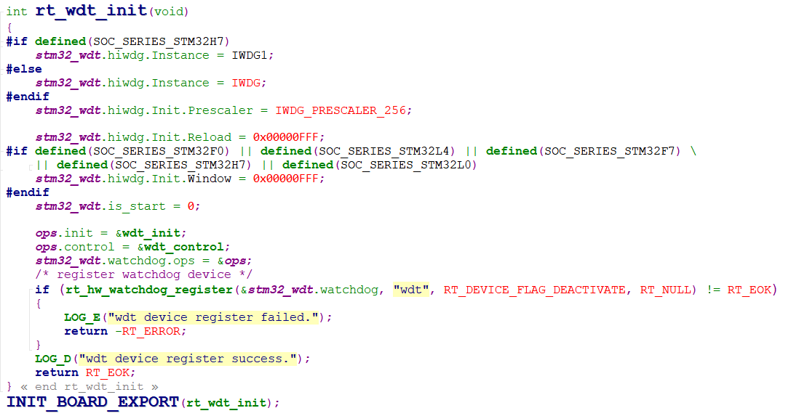

## 说明
RT-Thread为独立看门狗提供设备驱动底层文件watchdog.c，文件位于`rt-thread-master\rt-thread\components\drivers\watchdog`;该文件主要定义了WDT设备的驱动接口；

RTT-Thread还提供了独立看门狗的硬件驱动函数drv_wdt.c，在该文件中完成看门狗的初始化，以及底层驱动函数的操作方法的回调函数内容。

